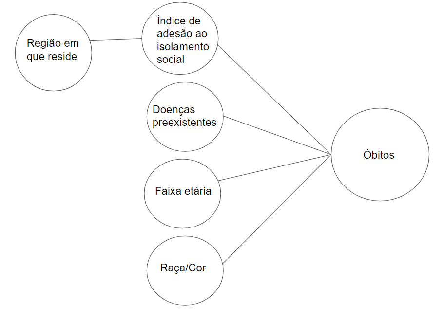

Laboratório 1 [18/09]

Pesquisa e importação de dados via Python em JSON, CSV ou XML. Exploração de diferentes formatos de fontes, formas de filtrar os dados e familiarização com API's.
Primeiro contato com a criação de diagramas de representação de dados e como associá-los.

## Tarefa 1 sobre APIs de acesso
[Notebook](https://github.com/robertaveronez/Banco-de-Dados/blob/master/lab01/notebook/lab01.ipynb)

## Tarefa 2 sobre Engenharia Reversa
>

