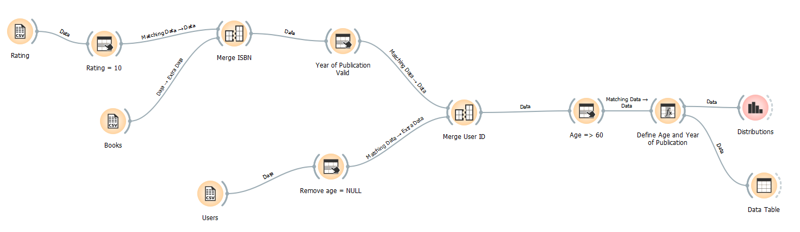
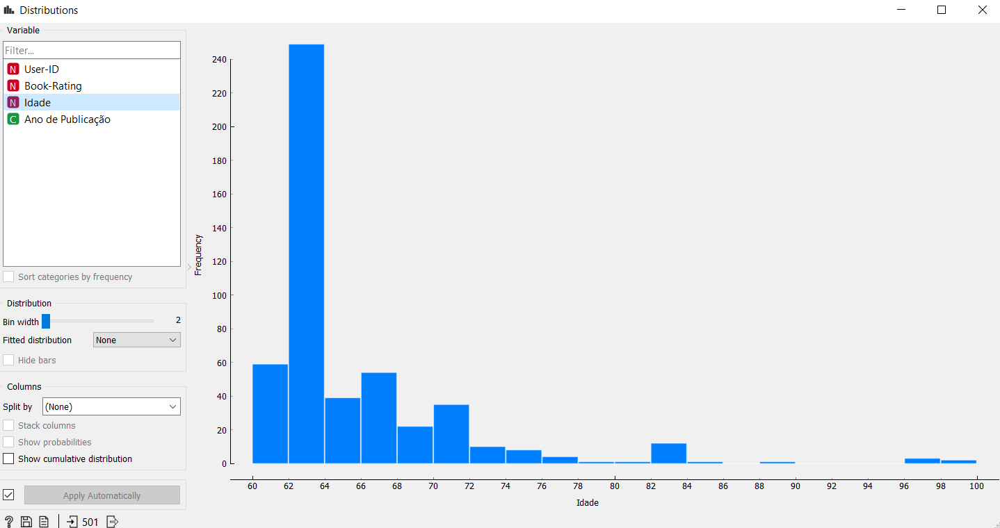
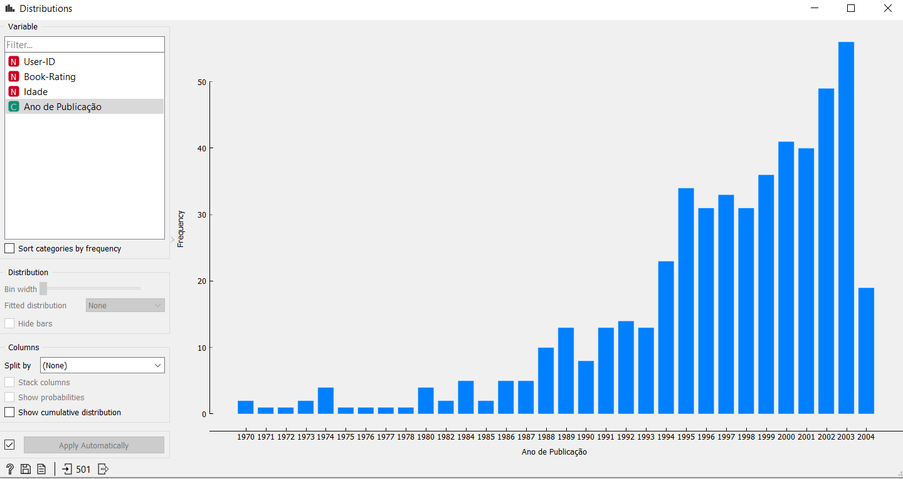

Laboratório 3 [09/10]

## Tarefa sobre Análise de Dados usando o Orange

[Arquivo Orange](https://github.com/robertaveronez/Banco-de-Dados/blob/master/lab03/orange/Books-Dataset.ows)

A imagem do fluxograma mostra o caminho para achar quais os anos de publicações de livros que pessoas com 60 ou mais anos avalia com nota 10.

Para a construção do fluxograma, começamos selecionando a partir do arquivo "BX-Book-Ratings" apenas as avaliações de valor 10, para mergear com o arquivo "BX-Books-partial" 
utilizando o a coluna ISBN como matching. Com isso, temos a relação de livros avaliados com nota 10.

O próximo passo é trazer os dados dos usuários a partir do arquivo "BX-Users", retirando os que possuem idade marcada como NULL. Na coluna de ano de publicação há alguns dados
inválidos também, então delimitamos a um valor > 1000. Com isso, mergeamos essas duas partes utilizando o user id como matching, resultando na relação de qual usuário avaliou
determinado livro com a nota 10.

O próximo passo é delimitar a idade dos usuários para 60 ou mais anos e para gerar a distribuição definimos o ano do usuário como como numeric e o ano de publicação de um livro
como categorical.

As distribuições mostram que pessoas com 60 ou mais anos tendem a avaliar com nota 10 livros que foram publicados recentemente, ao invés de livros que foram publicados dos anos
1993 para trás.

